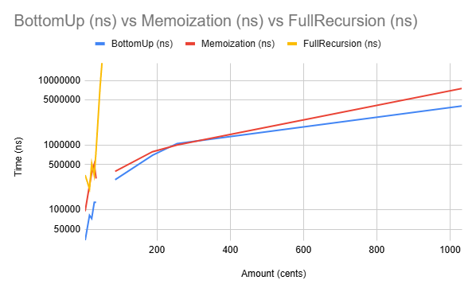

# CS-3410 Making Change Problem
**Project #2**  
**CS-3410 SP 26**  
**Emmett Bicknell & Brandon Aikman**  
**25 February 2026**

---

## I. Requirements

For this project, we were tasked with solving the "Making Change" problem with dynamic programming. We solved it three different ways: building the table bottom-up, recursively without memoization, and recursively with memoization. Additionally, we had to ensure that our programs took input through StdIn and outputted in the format of n cents = m:o for each test case.

## II. Design

We wrote our program following the framework and pseudocode provided in class. We have four .java files, one for each solution, and a CoinPurse class as well. The structure of our solution files start with defining static variables such as an integer for the number of denominations or an array for CoinPurses and problem numbers. Then, we define the NumCoins method, which returns the best CoinPurse based on one of the three methods above. Next, we define a printOutput method to print the result for each problems. Finally, in our main method, we read the user's input and perform the Making Change problem, calling both NumCoins and printOutput as appropriate.

## III. Security Analysis

This project does not contain any vulnerable operations; it is purely a performance analysis tool without file system writes beyond result logging. We do not have any concerns.

## IV. Implementation

We implemented three different approaches to the making change problem: top-down recursion, recursion with memoization, and bottom-up construction. Each approach uses a similar core loop, but applies it slightly differently. We made a separate file for each strategy.

## V. Testing

We tested using the Gradel page, and found that the files passed all tests. We also did testing of our own. Emmett mainly used the denomination set {1, 7, 17, 37} along with random values to see if it worked as expected, since these values are easy to check by hand. Brandon tested with the denomination set of {1, 7, 17, 23, 37, 52} with the provided sample data for the timing testing to create the graphs. These tests should be sufficient, because we covered several different assortments of denominations, as well as a wide range of values.

## VI. Summary/Conclusion

Our code worked exactly as intended. Brandon did testing on how long each algorithm took. We temporarily inserted time checks into our NumCoins method and tested a range of values. We used the data we found to create our graph. The graph shows that bottom-up and memoization both had runtimes that were O(n). This is to be expected, since NumCoins should only run calculations once for each value from 1 to n. Hence a constant number of operations performed n times should given O(n) time, as we found.
The runtime for recursion was abysmal. Our graph shows that the runtime gets incredibly large, even for relatively small values of n. This is to be expected, as the number of operations required for a fully recursive algorithm is very large.

## VII. AI Usage

We did not use AI to write our project.

## VIII. Analysis and Graph

As shown in the graph and as aforementioned, our program ran as expected. We see that fullrecursion grows very quickly, even on a logarithmic graph like the one above. We also notice that both Memoization and BottomUp grow linearly (though it appears as logarithmic growth due to the scale). Our timing method ensured that we got consistent results, and our results reflect the theory we sought to implement.